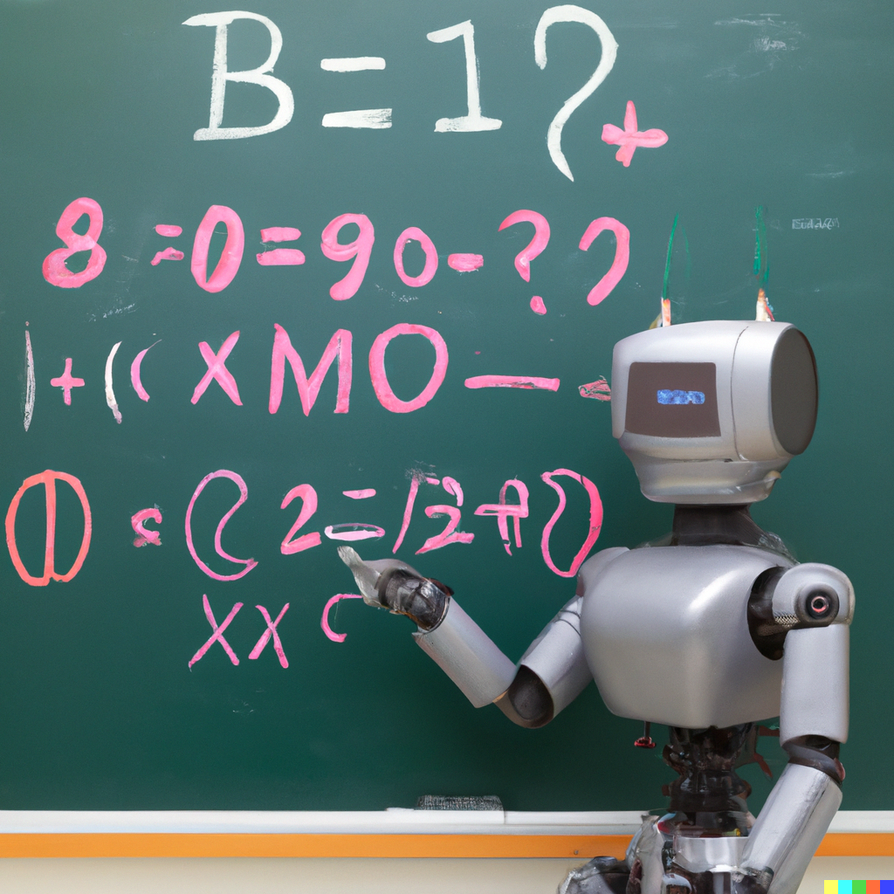

### Course Information

* **Course Info:**	CS7545, Spring 2023
* **Instructor:**	
* **Course Time&Place:**	TuTh 3:30-4:45pm, Weber SST III (Lecture Hall 1)
* **TA Office Hours:** We have office hours every Monday. Normally, we have one hour per week for the office hours (virtual office hours). In the homework submission weeks, we have three hours per week for the office hours (in-person office hours).  
    - *Date: 1/23, 2/6, 2/13, 2/20, 3/6, 4/3, 4/10, 4/24*
        - Monday 7pm-8pm (virtual office hours)
    - *Date: 1/30, 2/27, 3/13, 3/27, 4/17*
        - Monday 2pm-5pm (in-person office hours), CODA 2nd floor
    - *This week's zoom link*
        - [https://gatech.zoom.us/j/3216894294?pwd=YnJUd0lDVmI3YkNraDd1SnQrQlU5Zz09](https://gatech.zoom.us/j/3216894294?pwd=YnJUd0lDVmI3YkNraDd1SnQrQlU5Zz09)
* **Course Staff**:
    - *Jacob Abernethy*
        - **Office:**  Coda S1221
        - **Email:** prof_at_gatech_dot_edu
        - **Office Hours:** TBD
    - *Zihao Hu*
        - **Email:** zihaohu_at_gatech_dot_edu
        - **Office Hours**: Monday 7pm-8pm(1/23, 4/3), Monday 2pm-5pm (1/30, 3/27)
    - *Yeojoon Youn*
        - **Email:** yjyoun92_at_gatech_dot_edu
        - **Office Hours**: Monday 7pm-8pm(2/6, 2/13, 2/20), Monday 2pm-5pm (2/27, 3/27)
    - *Guanghui Wang*
        - **Email:** gwang369_at_gatech_dot_edu
        - **Office Hours:** Monday 7pm-8pm(3/6, 4/10, 4/24), Monday 2pm-5pm (3/13, 3/27)
    - *Tyler Labonte*
        - **Email:** tlabonte_gatech_dot_edu

### Course Description

This course will study theoretical aspects of prediction and decision-making probelms, and to explore the mathematical underpinnings of machine learning. We hope to bring students to the frontiers of research and to develop tools that can be used to contribute to emerging literature. The course will cover, among other things, concentration inequalities, uniform deviation bounds, Vapnik-Chervonenkis Theory, Rademacher Complexity, margin bounds, boosting, some theoretical aspects of deep learning, online learning theory, regret minimization, multi-armed bandit algorithms, and connections to convex optimization. Additional topics may be covered if time permits, including reinforcement learning theory, differential privacy, sampling, and and other areas of interest. 

**Prerequisites:** Familiarity with the analysis of algorithms, probabilistic analysis, and several similar topics. CS7641 (Machine Learning) may be helpful but not strictly necessary. The material will be about 90% "theory" and thus students must have a strong mathematical background. We shall rely heavily on techniques from calculus, probability, and convex analysis, but many tools will be reviewed in lecture.

**Coursework:** There will be 4 problem sets throughout the semester.

**Grade Breakdown:**
* 40% - *Homeworks*
* 30% - *Exam*
* 20% - *Final project*
* 10% - *Scribing/participation*

**Note**: The exam will be held on Thursday March 30 during classtime.

### Lecture notes

Every lecture will have two student scribes, and this pair of students will be asked to take detailed notes in class on what was covered. The quality of these notes will be graded! 

**Grade Rubric:**
* 20% - *punctuality*
* 40% - *correctness*
* 40% - *readability*

[Here is the course wiki](https://github.com/mltheory/CS7545/wiki).

Note: all students are allowed and encouraged to contribute to this wiki! Once the scribes have submitted their notes, other students are welcome to add any additional comments, results, material, etc. to the lecture notes. It would be great if the wiki provides a broad set of resources for students, beyond what was covered in lecture.

### References:

Roughly half of the course will follow material from the following text:

 * "[Foundations of Machine Learning](https://www.amazon.com/Foundations-Machine-Learning-Adaptive-Computation/dp/026201825X)" by Mehryar Mohri, Afshin Rostamizadeh, and Ameet Talwalkar
 * "[Understanding Machine Learning: From Theory to Algorithms](https://www.cs.huji.ac.il/~shais/UnderstandingMachineLearning/understanding-machine-learning-theory-algorithms.pdf)" by Shai Shalev-Shwartz and Shai Ben-David

Much of the material in online learning is specific to this course. For students that want more in-depth reading material on this topic, however, there are several surveys released in the last several years that explore several many areas we shall cover. These include:

* [The Multiplicative Weights Update Method](http://www.cs.princeton.edu/~arora/pubs/MWsurvey.pdf) by Sanjeev Arora, Elad Hazan, and Satyen Kale.
* [Online Learning and Online Convex Optimization survey](http://www.cs.huji.ac.il/~shais/papers/OLsurvey.pdf) by Shai Shalev-Shwartz.
* [The convex optimization approach to regret minimization survey](http://www.cs.princeton.edu/~ehazan/papers/OCO-survey.pdf) by Elad Hazan.
* [Sasha Rakhlin's Lecture Notes](http://www-stat.wharton.upenn.edu/~rakhlin/courses/stat928/stat928_notes.pdf).

[The Latex template for HW submissions is available here.](./hw/CS7545hw_template.tex)

Previous offerings of the course: 
- [Fall 2018](./Fall18)
- [Fall 2019](./Fall19)

### Homeworks

| Homework | Due Date  | 
| :------------: |:-------------: |
| [Homework 1](./hw/CS7545_HW1.pdf) | January 31, 2023, 11:59 pm |
| [Homework 2](./hw/CS7545_HW2.pdf) | February 21, 2023, 11:59 pm |
